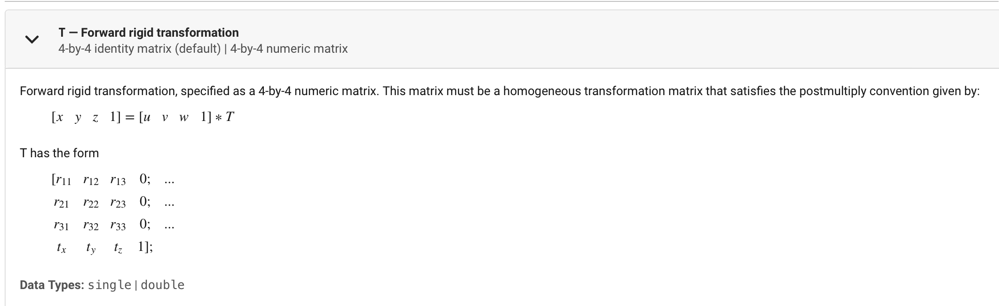

# LidarCameraCalibration
Steps to use MATLAB calibration toolbox for lidar camera calibration. In my case, I used the MATLAB R2024b version.

This repo includes the steps to use the MATLAB [single camera calibration toolbox](https://www.mathworks.com/help/vision/ug/using-the-single-camera-calibrator-app.html) and [lidar camera calibration toolbox](https://www.mathworks.com/help/lidar/ug/get-started-lidar-camera-calibrator.html).

It covers the following topics:
- [Single Camera Calibration](#single-camera-calibration)
- [Lidar Camera Calibration](#lidar-camera-calibration)


## Data Organization
Folder Structure is as follows:

```bash
parent_folder_path
├── Bags
│   ├── cam{id}_{lidar_id} # where id is from 0 to 5, indicating from front left to rear left in clockwise order; lidar_id is from [front, BP_F, BP_R]
│   │   ├── metadata.yaml (metadata for the ros2 bag)
│   │   └── .db3 (ros2 bag file)
│   └── ...
└── paired_results (this folder is generated via the codes)
    ├── cam{id}_{lidar_id}
    │   ├── Images (raw images)
    │   ├── PointClouds (raw point clouds)
    │   ├── UndistImages (rectified images)
    │   ├── CropPointClouds (cropped point clouds in region of interest)
    │   ├── calibrationSession.mat (Saved camera calibration session)
    │   ├── lccSession.mat (Saved lidar camera calibration session)
    │   └──  ...
    └── ...
```

Use this [parseRosbag.m](./scripts/parseRosbag.m) to convert the rosbag file to png and pcd files. This will synchronize the lidar point cloud and camera image, and downsample the point cloud and image to the specified rate. This script is based on [this link](https://www.mathworks.com/help/lidar/ug/read-lidar-and-camera-data-from-rosbag.html).
Here you need to modify the following parameters:
- `parent_folder_path`: the folder for the whole project, like shown in the folder structure
- `cam_id`: the camera id number (e.g. 0, 1, 2, etc. front-left -> rear-left, clockwise)
- `lidar_id`: the selected lidar (e.g. front, BP_F, BP_R)
- `downsample_rate`: the downsample rate for the lidar point cloud and image, typically the lidar runs at 10Hz, it's not necessary to save all the point clouds and images.

## Change Matlab WorkSpace Path
After you convert the rosbag to png and pcd files, you should change the path to the path containing the Images and PointClouds (example: paired_results/node1/front_left). Then when you run other Matlab scripts, choose `Add to Path` instead of `Change Folder` to make sure you are still in the correct folder.

For following procedures to load files and save files, always make sure you are selecting the correct folder especially when you are doing multiple calibrations.

## Single Camera Calibration
### Camera Calibration
- Launch the single camera calibration app
- Load the images from files, use `Checkerboard` as the pattern, and `90mm` as the square size, choose `Image distortion` as `Low`
- In `Options`, choose `2 Coefficients` for `Radial distortion`, and `Tangential distortion` as `Enabled`, this is the commonly used plumb bob model
- Remove the unwanted images in `Data Browser`, and then `Calibrate`
- After the calibration, you can check the reprojection error, and then export the calibration result
- It's recommended to save the calibration session, so that you can load it later and check the reprojection error again


### Convert the Camera Calibration to ROS format
You can run the [convert_intrinsic_into_yaml.m](./scripts/convert_intrinsic_into_yaml.m) to convert the intrinsic parameters into yaml file, which can be used in the [image_proc](http://wiki.ros.org/image_proc) ROS package. It will first load the saved `calibrationSession.mat` file, and then convert the intrinsic parameters into the ROS format.

**Note**: Make sure the current path is set to the folder containing the `calibrationSession.mat` file, and run the script via `Add to Path` instead of `Change Folder`.


### Undistort Images
Use the [undist_all_images.m](./scripts/undist_all_images.m) script to undistort the images, it also generate a new `undistCameraParams` to store the parameters for the undistorted images, which will be used in the lidar camera calibration.


## Lidar Camera Calibration
### Preparation
Before you start the lidar camera calibration, you are recommended to check the following things:
- Check the `UndistImages` folder, delete the images that are not good, like the images with the checkerboard not fully visible. Even though the calibration toolbox can tell the bad images, it's better to remove them manually.
- Run the [crop_points.m](./scripts/crop_points.m) to crop the point clouds, it limits the point cloud into a region of interest, where you may remove the ground plane, or the points that are too far away from the camera, etc. This will reduce the computation time for the calibration. This script will only look for the point clouds with corresponding undistorted images, so you can safely delete unwanted images in the `UndistImages` folder.
- When you run the [crop_points.m](./scripts/crop_points.m) script, it will prompt you to select the region of interest in the point cloud. You can use the mouse to draw a bounding box around the area you want to keep, and then press `Enter` to confirm the selection.

### Lidar Camera Calibration
- Launch the lidar camera calibration app
- Load the **undistorted images** and point clouds, choose `Checkerboard` as the pattern, and `90mm` as the square size, also specify the `padding` size as `60mm`
- `Use Fixed Intrinsic` for the camera, and load the `undistCameraParams.mat` file
- You may **not** need the `Remove Ground` option, if you have already cropped the point clouds using the [crop_points.m](./scripts/crop_points.m) script
- You need to `Edit ROI` to adjust (expand) the ROI to make sure it includes the checkerboard plane points
- Try to `Detect Checkerboard` first, if it fails, you can try to adjust the `Cluster Threshold` and `Dimension Tolerance` to make it work. 0.25 for `Cluster Threshold` and 0.2 for `Dimension Tolerance` should be a good option.
    - Cluster Threshold — Clustering threshold for two adjacent points in the point cloud, specified in meters. The clustering process is based on the Euclidean distance between adjacent points. If the distance between two adjacent points is less than the clustering threshold, both points belong to the same cluster. Low-resolution lidar sensors require a higher Cluster Threshold, while high-resolution lidar sensors benefit from a lower Cluster Threshold.
    - Dimension Tolerance — Tolerance for uncertainty in the rectangular plane dimensions, specified in the range [0,1]. A higher Dimension Tolerance indicates a more tolerant range for the rectangular plane dimensions.
- If the matched data is not enough, you can then try to `Select Checkerboard` manually, where you can select the checkerboard plane points manually. If you **didn't** crop the points, you may struggle to tune the view angle to select the checkerboard plane points, so it's recommended to crop the points first.
- Then `Calibrate`, after the calibration, you can check the reprojection error, and then export the calibration result.
- When you find the reprojection error is quite high even if the checkerboard plane is clearly visible, you may need to adjust the `Initial Transform` to make the checkerboard plane more parallel with the lidar scanning plane. For `Initial Transform`, this is necessary when the orientation of the two sensors are not aligned, you need to use the [rigid3d](https://www.mathworks.com/help/images/ref/rigid3d.html) function to define a rigid3d class for initial transform. Please note the `T` used in Matlab is **not the common way** as we use:


- It's also recommended to save the calibration session, so that you can load it later and check the reprojection error again.

### Export the calibration result into ROS desired format
Through the Lidar Camera Calibration, we can get the transformation matrix that transforms the lidar points into the camera frame. 

However, the transformation matrix is not in the format that can be used in ROS. So we need to convert the transformation matrix into the format that can be used in ROS. Here we use the [convert_tform_to_ROS.m](./scripts/convert_tform_to_ROS.m) script to convert the transformation matrix into yaml file, where you can use it in the static transform publisher to publish the transformation between the lidar and camera frame.

The desired format is shown below:
`static_transform_publisher x y z yaw pitch roll frame_id child_frame_id period_in_ms` (yaw is rotation about Z, pitch is rotation about Y, and roll is rotation about X) in radians.
The frame_id is typically the lidar frame, and the child_frame_id is typically the camera frame. So the translation vector is the position of the camera frame in the lidar frame, and the rotation vector is the rotation of the camera frame in the lidar frame.
