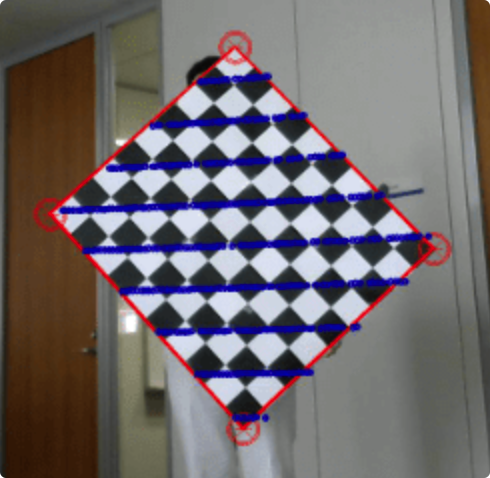

# LidarCameraCalibration
Steps to use MATLAB calibration toolbox for lidar camera calibration

This repo includes the steps to use the MATLAB [single camera calibration toolbox](https://www.mathworks.com/help/vision/ug/using-the-single-camera-calibrator-app.html) and [lidar camera calibration toolbox](https://www.mathworks.com/help/lidar/ug/get-started-lidar-camera-calibrator.html).

It covers the following topics:
- [Data Collection](#data-collection)
- [Single Camera Calibration](#single-camera-calibration)
- [Lidar Camera Calibration](#lidar-camera-calibration)

## Data Collection
The checkerboard used in this repo is a 9x6 checkerboard with 90mm square size, the padding is 60mm, as shown in the following figure.

The data is collected as rosbag files, the lidars and cameras are fixed on a parked vehicle, the checkerboard is hold by a person (it's recommended to use a tripod to hold the checkerboard).

### Notes for data collection:
- The background should be clear, try to avoid objects with similar pattern as the checkerboard, like walls, fences, etc.
- If holding the checkerboard by hand, please try to **keep the checkerboard far from human body**, so that the checkboard plane can be clearly detected by the lidar, otherwise the points from human body may also be clustered into the checkerboard plane, which will affect the calibration result.
- Don't **block the plane by the human hand**.
- The checkerboard should be placed in the field of view of the camera and lidar, and the checkerboard should be visible by both camera and lidar.
- For the **camera only** calibration, the checkerboard can be placed in **any orientation**.
- For the **lidar camera** calibration, the checkerboard should **not** be placed in parallel with the lidar scanning plane, otherwise the **four corners** of the checkerboard may not be estimated correctly. A recommended orientation is shown in the following figure.

### Data Preprocessing
Use this [parseRosbag.m](./scripts/parseRosbag.m) to convert the rosbag file to png and pcd files. This will synchronize the lidar point cloud and camera image, and downsample the point cloud and image to the specified rate. This script is based on [this link](https://www.mathworks.com/help/lidar/ug/read-lidar-and-camera-data-from-rosbag.html).
Here you need to modify the following parameters:
- `rosbag_path`: the rosbag file path
- `save_path`: the directory to save the files
- `imageTopic`: the image topic name
- `lidarTopic`: the lidar topic name
- `downsample_rate`: the downsample rate for the lidar point cloud and image, typically the lidar runs at 10Hz, it's not necessary to save all the point clouds and images, so we can downsample the point cloud and image to 1Hz or 0.5Hz.

## Single Camera Calibration
### Camera Calibration
- Launch the single camera calibration app
- Load the images from files, use `Checkerboard` as the pattern, and `90mm` as the square size, choose `Image distortion` as `High`
- In `Options`, choose `2 Coefficients` for `Radial distortion`, and `Tangential distortion` as `Enabled`, this is the commonly used plumb bob model
- Remove the unwanted images in `Data Browser`, and then `Calibrate`
- After the calibration, you can check the reprojection error, and then export the calibration result
- It's recommended to save the calibration session, so that you can load it later and check the reprojection error again

### Undistort Images
Use the [undist_al_images.m](./scripts/undist_all_images.m) script to undistort the images, it also generate a new `undistCameraParams` to store the parameters for the undistorted images, which will be used in the lidar camera calibration.
Here you need to modify the following parameters:
- 'save_path': the parent folder where you save the paired images and point clouds

You can also run the [convert_intrinsic_into_yaml.m](./scripts/convert_intrinsic_into_yaml.m) to convert the intrinsic parameters into yaml file, which can be used in the [image_proc](http://wiki.ros.org/image_proc) ROS package.

## Lidar Camera Calibration
### Preparation
Before you start the lidar camera calibration, you are recommended to check the following things:
- Check the `UndistImages` folder, delete the images that are not good, like the images with the checkerboard not fully visible. Even though the calibration toolbox can tell the bad images, it's better to remove them manually.
- Run the [crop_points.m](./scripts/crop_points.m) to crop the point clouds, it limits the point cloud into a region of interest, where you may remove the ground plane, or the points that are too far away from the camera, etc. This will reduce the computation time for the calibration. This script will only look for the point clouds with corresponding undistorted images, so you can safely delete unwanted images in the `UndistImages` folder.

### Lidar Camera Calibration
- Launch the lidar camera calibration app
- Load the **undistorted images** and point clouds, choose `Checkerboard` as the pattern, and `90mm` as the square size, also specify the `padding` size as `60mm`
- `Use Fixed Intrinsic` for the camera, and load the `undistCameraParams.mat` file
- You may not need the `Remove Ground` option, if you have already cropped the point clouds using the [crop_points.m](./scripts/crop_points.m) script
- Try to `Detect Checkerboard` first, if it fails, you can try to adjust the `Cluster Threshold` and `Dimension Tolerance` to make it work
    - Cluster Threshold — Clustering threshold for two adjacent points in the point cloud, specified in meters. The clustering process is based on the Euclidean distance between adjacent points. If the distance between two adjacent points is less than the clustering threshold, both points belong to the same cluster. Low-resolution lidar sensors require a higher Cluster Threshold, while high-resolution lidar sensors benefit from a lower Cluster Threshold.
    - Dimension Tolerance — Tolerance for uncertainty in the rectangular plane dimensions, specified in the range [0,1]. A higher Dimension Tolerance indicates a more tolerant range for the rectangular plane dimensions.
- If the matched data is not enough, you can then try to `Select Checkerboard` manually, where you can select the checkerboard plane points manually. If you **didn't** crop the points, you may struggle to tune the view angle to select the checkerboard plane points, so it's recommended to crop the points first.
- Then `Calibrate`, after the calibration, you can check the reprojection error, and then export the calibration result.
- When you find the reprojection error is quite high even if the checkerboard plane is clearly visible, you may need to adjust the `Initial Transform` to make the checkerboard plane more parallel with the lidar scanning plane. For `Initial Transform`, this is necessary when the orientation of the two sensors are not aligned, you need to use the [rigid3d](https://www.mathworks.com/help/images/ref/rigid3d.html) function to define a rigid3d class for initial transform. Please note the `T` used in Matlab is **not the common way** as we use:

- It's also recommended to save the calibration session, so that you can load it later and check the reprojection error again.

### Export the calibration result into ROS desired format
